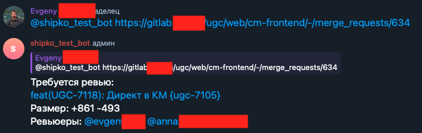
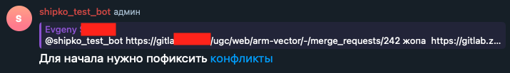
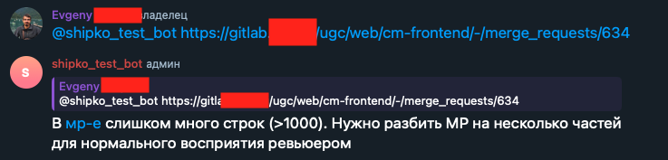

## Telegram Bot for Code Review

### Bot Features:
* Assigns reviewers from the intersection of two lists: members of the chat where the bot is added, and `REVIEW_PARTICIPANTS_IDS`  
  
* Remembers who reviewed last and assigns the next review to someone else, iterating through the list of chat members
* If a merge request has conflicts, the bot prevents it from being submitted for review  
  
* If the number of changed lines in a merge request exceeds the `MAXIMUM_ROWS_CHANGED` value, the bot blocks it from being submitted for review  
  
* The bot supports vacation tracking: a user can mark themselves as on vacation, or an admin can do it for them

### Implementation Details
* The bot can store its state either in memory or in Redis
* A role-based access model is implemented — some commands are available only to admins, others only to reviewers. If a user is both a reviewer and an admin, they have access to all commands
* The bot ignores messages from users who are not in the list of reviewers or admins
* A scene system (inspired by [scenes from the JS framework Telegraf](https://github.com/telegraf/telegraf/issues/705)) is implemented to define user interaction flows with the bot. It maintains user conversation context and remembers the stage of the scenario the user is currently in

### Launching the Bot
1. Create a new bot via [@BotFather](https://t.me/BotFather) on Telegram
2. Create a `.env` file in the root directory and fill it with values following the `.env.sample` example
3. Start the bot
```bash
go build code-review-tg-bot/main

